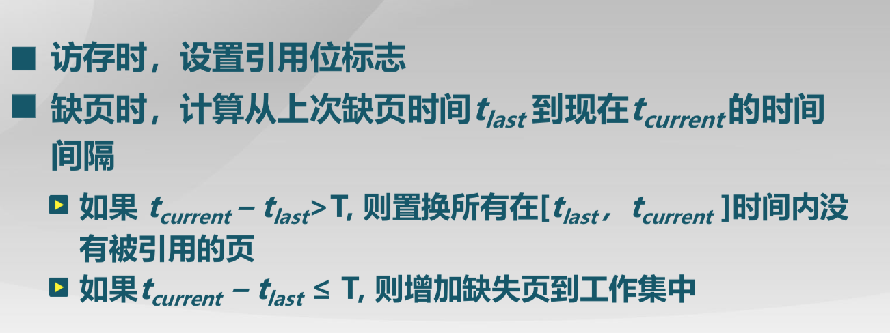

#lec9: 虚存置换算法spoc练习

## 视频相关思考题

### 9.1 页面置换算法的概念

1. 设计置换算法时需要考虑哪些影响因素？如何评判的好坏？
* 效率因素，尽可能地减少页面的调入调出次数
* 更好的性能

2. 全局和局部置换算法的不同？
* 局部置换算法：
    * 置换页面的选择范围仅限于当前进程占用的物理页面内
* 全局置换算法：
    * 置换页面的选择范围是所有可换出的物理页面
    * 全局置换算法为进程分配可变数目的物理页面
    * 全局置换算法需要确定分配给进程的物理页面数

### 9.2 最优算法、先进先出算法和最近最久未使用算法

1. 最优算法、先进先出算法和LRU算法的思路？
* 最优算法：替换出未来最长时间不访问的页面，但是实践上是不可行的，因为无法准确的预知，只是理想状况下的最优
* 先进先出算法：选择在内存驻留时间最长的页面进行置换，整个过程类似于对于栈的操作
* 最近最久未使用算法：选择最长时间没有被引用的页面进行置换

### 9.3 时钟置换算法和最不常用算法

1. 时钟置换算法的思路？
* 对页面的访问情况进行大致统计，在页表项中增加访问位，描述页面在过去一段时间的内访问情况，各页面组织成环形链表，指针指向最先调入的页面
* 访问页面时，在页表项记录页面访问情况
* 缺页时，从指针处开始顺序查找未被访问的页面进行置换

2. 改进的时钟置换算法与时钟置换算法有什么不同？
* 为了减少修改页的缺页处理开销
* 在替换出被修改过的页面的时候，会涉及到将脏页写回的过程，使得开销会很大，所以尽可能的减少替换出脏页的可能
* 在页面中增加修改位，并在访问时进行相应修改，即在寻找要替换出的页面的时候，若使用位为1，则变为0，若修改位为1，则变为0，只有当遇到
使用位和修改位均为0的时候才换出。

3. LFU算法的思路？
* 换出页的时候，置换访问次数最少的页面

### 9.4 Belady现象和局部置换算法比较

1. 什么是Belady现象？如何判断一种置换算法是否存在Belady现象？
* Belady现象：采用FIFO等算法时，可能出现分配的物理页面数增加，缺页次数反而升高的异常现象
* 如何判断是否存在belady现象：看这个替换算法是否满足访问的局部性原理

2. 请证明LRU算法不存在Belady现象。
* LRU算法替换的是最长时间没有被引用的页面，根据局部性原理，当前被访问的页面很有可能在未来一段时间被再次访问
* 假设替换出去的不是这个页面，那么被替换的页面在未来被再次访问的概率大于最长时间没有被引用的页面，从而效率更高

### 9.5 工作集置换算法

1. CPU利用率与并发进程数的关系是什么？
* CPU利用率与并发进程数存在相互促进和制约的关系
    * 进程数少时，提高并发进程数，可提高CPU利用率
    * 并发进程导致内存访问增加
    * 并发进程的内存访问会降低了访存的局部性特征
    * 局部性特征的下降会导致缺页率上升和CPU利用率下降

2. 什么是工作集？
* 工作集是一个进程当前正在使用的逻辑页面集合，$W(t,\delta)$, 当前时刻$t$前的$\delta$时间窗口中的所有 访问页面所组成的集合

3. 什么是常驻集？
* 在当前时刻，进程实际驻留在内存当中的页面集合

4. 工作集算法的思路？
* 换出不在工作集中的页面

### 9.6 缺页率置换算法

1. 缺页率算法的思路？
*  

### 9.7 抖动和负载控制

1. 什么是虚拟内存管理的抖动现象？
* 进程物理页面太少，不能包含工作集,造成大量缺页，频繁置换,从而使得进程运行速度变慢

2. 操作系统负载控制的最佳状态是什么状态？
* 系统需在并发水平和缺页率之间达到一个平衡
3. 局部置换算法（如FIFO, LRU等）是否能作为全局置换算法来使用？为什么？
* 不能
    * 页面在进程内的局部性质不等价于其全局性质
----

## 扩展思考题

1.  改进时钟置换算法的极端情况: 如果所有的页面都被修改过了，这时需要分配新的页面时，算法的performance会如何？能否改进在保证正确的前提下提高缺页中断的处理时间？

2.  如何设计改进时钟算法的写回策略?

3. （spoc）根据你的`学号 mod 4`的结果值，确定选择四种页面置换算法（0：LRU置换算法，1:改进的clock 页置换算法，2：工作集页置换算法，3：缺页率置换算法）中的一种来设计一个应用程序（可基于python, ruby, C, C++，LISP等）模拟实现，并给出测试用例和测试结果。请参考如python代码或独自实现。
 - [页置换算法实现的参考实例](https://github.com/chyyuu/ucore_lab/blob/master/related_info/lab3/page-replacement-policy.py)     

4. 请判断OPT、LRU、FIFO、Clock和LFU等各页面置换算法是否存在Belady现象？如果存在，给出实例；如果不存在，给出证明。

5. 了解LIRS页置换算法的设计思路，尝试用高级语言实现其基本思路。此算法是江松博士（导师：张晓东博士）设计完成的，非常不错！
	- 参考信息：
 	- [LIRS conf paper](http://www.ece.eng.wayne.edu/~sjiang/pubs/papers/jiang02_LIRS.pdf)
	 - [LIRS journal paper](http://www.ece.eng.wayne.edu/~sjiang/pubs/papers/jiang05_LIRS.pdf)
	 - [LIRS-replacement ppt1](http://dragonstar.ict.ac.cn/course_09/XD_Zhang/(6)-LIRS-replacement.pdf)
	 - [LIRS-replacement ppt2](http://www.ece.eng.wayne.edu/~sjiang/Projects/LIRS/sig02.ppt)
