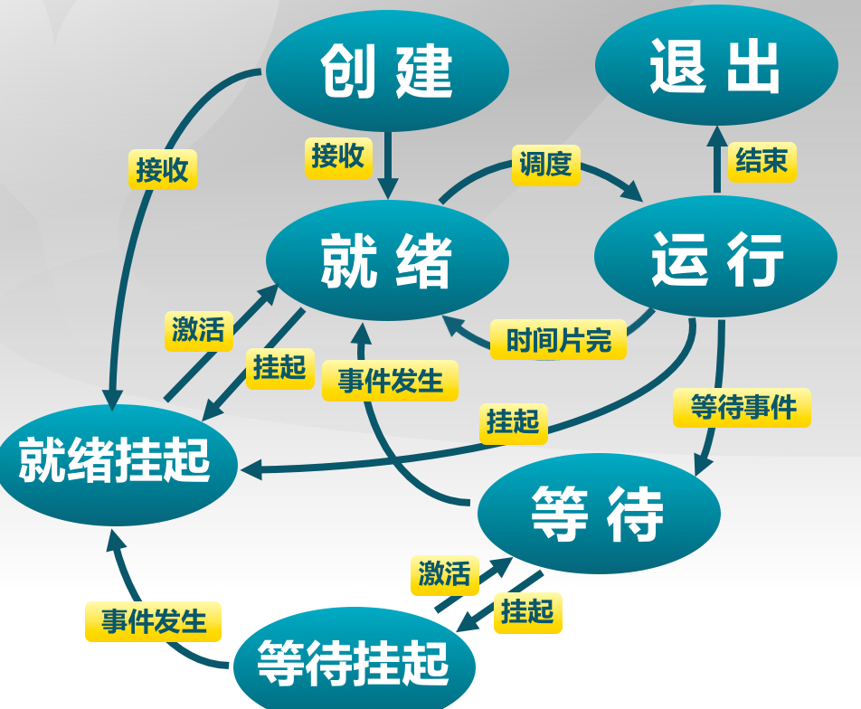

#lec11: 进程／线程概念spoc练习

## 视频相关思考题

### 11.1 进程的概念

1. 什么是程序？什么是进程？
* 进程：进程是指一个具有一定独立功能的程序在一个数据集合上的一次动态执行过程
* 程序：为使电子计算机执行一个或多个操作，按顺序设计的计算机指令的集合。


2. 进程有哪些组成部分？
进程包含了正在运行的一个程序的所有状态的信息
* 代码
* 数据
* 状态寄存器
* 通用寄存器
* 进程占用的系统资源


3. 请举例说明进程的独立性和制约性的含义。
* 独立性：进程可以被独立调度并占用处理机运行
* 制约性：进程的工作不相互影响，但是因访问的共享数据/资源或进程间的同步而产生制约

4. 程序和进程联系和区别是什么？
* 进程是操作系统处于执行状态程序的抽象
    * 程序 = 静态的可执行文件
    * 进程= 执行中的程序 = 程序 + 执行状态
* 同一个程序的多次执行对应于多个进程
* 进程执行需要内存（保存代码和数据）、CPU（执行指令）

### 11.2 进程控制块

1. 进程控制块的功能是什么？
* 操作系统管理控制进程运行所用的信息集合
* 描述进程的基本情况以及运行变化的过程


2. 进程控制块中包括什么信息？
* 进程标识信息
* 处理机现场保存
* 进程控制信息
    * 调度和状态信息
    * 进程间通信信息
    * 存储管理信息
    * 进程所用资源
    * 有关数据结构连接信息

3. ucore的进展控制块数据结构定义中哪些字段？有什么作用？

  
### 11.3 进程状态

1. 进程生命周期中的相关事件有些什么？它们对应的进程状态变化是什么？
* 进程创建： 正在运行的进程执行了创建进程的系统调用
* 进程执行
* 进程等待
* 进程抢占
* 进程唤醒
* 进程结束


### 11.4 三状态进程模型

1. 运行、就绪和等待三种状态的含义？7个状态转换事件的触发条件是什么？
* 运行：进程在处理机上运行
* 就绪：进程获得了除虚拟机之外的所需资源，得到处理机即可执行
* 等待：进程正在等待某一时间的出现而暂停运行
* 触发条件：如图所示
    

### 11.5 挂起进程模型

1. 引入挂起状态的目的是什么？
* 处在挂起状态的进程映像在磁盘上，目的是减少进程占用内存
    * 等待挂起：进程在外存中并等待某事件的出现
    * 就绪挂起：进程在外存，但只要进入内存，即可运行

2. 引入挂起状态后，状态转换事件和触发条件有什么变化？
* 增加了很多状态之间的转换

3. 内存中的什么内容放到外存中，就算是挂起状态？


### 11.6 线程的概念

1. 引入线程的目的是什么？
* 进程之间的切换开销较大，寻找一种简单的并发执行关系

2. 什么是线程？
* 线程是进程的一部分，描述指令流执行状态。它是进程中的指令执行流的最小单元，是CPU调度的基本单位

3. 进程与线程的联系和区别是什么？
* 线程是进程的一部分，是进程中的指令执行流的最小单元
* 线程 = 进程 - 共享资源
* 进程是资源分配单位，线程是CPU调度单位
* 进程拥有一个完整的资源平台，而线程只独享指令流执行的必要资源，如寄存器和栈
* 线程具有就绪、等待和运行三种基本状态和状态间的转换关系
* 线程能减少并发执行的时间和空间开销
    * 线程的创建时间比进程短 
    * 线程的终止时间比进程短 
    * 同一进程内的线程切换时间比进程短
    * 由于同一进程的各线程间共享内存和文件资源，可不通过内核进行直接通信
 
### 11.7 用户线程

1. 什么是用户线程？
* 由一组用户级的线程库函数来完成线程的管理， 包括线程的创建、终止、同步和调度等

2. 用户线程的线程控制块保存在用户地址空间还是在内核地址空间？
* 用户地址空间


### 11.8 内核线程

1. 用户线程与内核线程的区别是什么？
* 内核线程由内核通过系统调用实现的线程机制，由内核完成线程的创建、终止和管理
* 内核线程的TCB保存在内核地址空间中

2. 同一进程内的不同线程可以共用一个相同的内核栈吗？
* 

3. 同一进程内的不同线程可以共用一个相同的用户栈吗？
* 不能吧，不同线程的用户栈是独有的吧

## 选做题
1. 请尝试描述用户线程堆栈的可能维护方法。

## 小组思考题
(1) 熟悉和理解下面的简化进程管理系统中的进程状态变化情况。
 - [简化的三状态进程管理子系统使用帮助](https://github.com/chyyuu/os_tutorial_lab/blob/master/ostep/ostep7-process-run.md)
 - [简化的三状态进程管理子系统实现脚本](https://github.com/chyyuu/os_tutorial_lab/blob/master/ostep/ostep7-process-run.py)

(2) (spoc)设计一个简化的进程管理子系统，可以管理并调度如下简化进程。在理解[参考代码](https://github.com/chyyuu/ucore_lab/blob/master/related_info/lab4/process-concept-homework.py)的基础上，完成＂YOUR CODE"部分的内容。然后通过测试用例和比较自己的实现与往届同学的结果，评价自己的实现是否正确。可２个人一组。

### 进程的状态 

 - RUNNING - 进程正在使用CPU
 - READY   - 进程可使用CPU
 - DONE    - 进程结束

### 进程的行为
 - 使用CPU, 
 - 发出YIELD请求,放弃使用CPU


### 进程调度
 - 使用FIFO/FCFS：先来先服务,
   - 先查找位于proc_info队列的curr_proc元素(当前进程)之后的进程(curr_proc+1..end)是否处于READY态，
   - 再查找位于proc_info队列的curr_proc元素(当前进程)之前的进程(begin..curr_proc-1)是否处于READY态
   - 如都没有，继续执行curr_proc直到结束

### 关键模拟变量
 - 进程控制块
```
PROC_CODE = 'code_'
PROC_PC = 'pc_'
PROC_ID = 'pid_'
PROC_STATE = 'proc_state_'
```
 - 当前进程 curr_proc 
 - 进程列表：proc_info是就绪进程的队列（list），
 - 在命令行（如下所示）需要说明每进程的行为特征：（１）使用CPU ;(2)等待I/O
```
   -l PROCESS_LIST, --processlist= X1:Y1,X2:Y2,...
   X 是进程的执行指令数; 
   Ｙ是执行CPU的比例(0..100) ，如果是100，表示不会发出yield操作
```
 - 进程切换行为：系统决定何时(when)切换进程:进程结束或进程发出yield请求

### 进程执行
```
instruction_to_execute = self.proc_info[self.curr_proc][PROC_CODE].pop(0)
```

### 关键函数
 - 系统执行过程：run
 - 执行状态切换函数:　move_to_ready/running/done　
 - 调度函数：next_proc

### 执行实例

#### 例１
```
$./process-simulation.py -l 5:50
Process 0
  yld
  yld
  cpu
  cpu
  yld

Important behaviors:
  System will switch when the current process is FINISHED or ISSUES AN YIELD
Time     PID: 0 
  1     RUN:yld 
  2     RUN:yld 
  3     RUN:cpu 
  4     RUN:cpu 
  5     RUN:yld 

```

   
#### 例２
```
$./process-simulation.py  -l 5:50,5:50
Produce a trace of what would happen when you run these processes:
Process 0
  yld
  yld
  cpu
  cpu
  yld

Process 1
  cpu
  yld
  cpu
  cpu
  yld

Important behaviors:
  System will switch when the current process is FINISHED or ISSUES AN YIELD
Time     PID: 0     PID: 1 
  1     RUN:yld      READY 
  2       READY    RUN:cpu 
  3       READY    RUN:yld 
  4     RUN:yld      READY 
  5       READY    RUN:cpu 
  6       READY    RUN:cpu 
  7       READY    RUN:yld 
  8     RUN:cpu      READY 
  9     RUN:cpu      READY 
 10     RUN:yld      READY 
 11     RUNNING       DONE 
```
